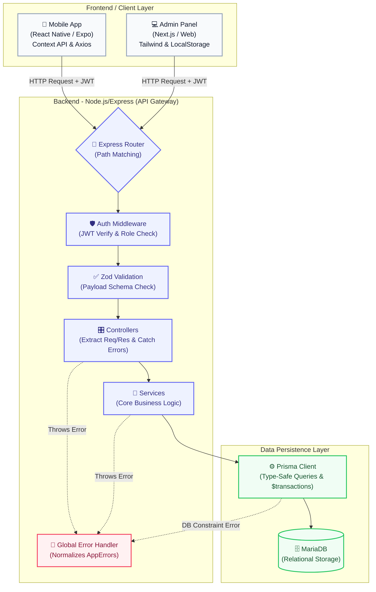
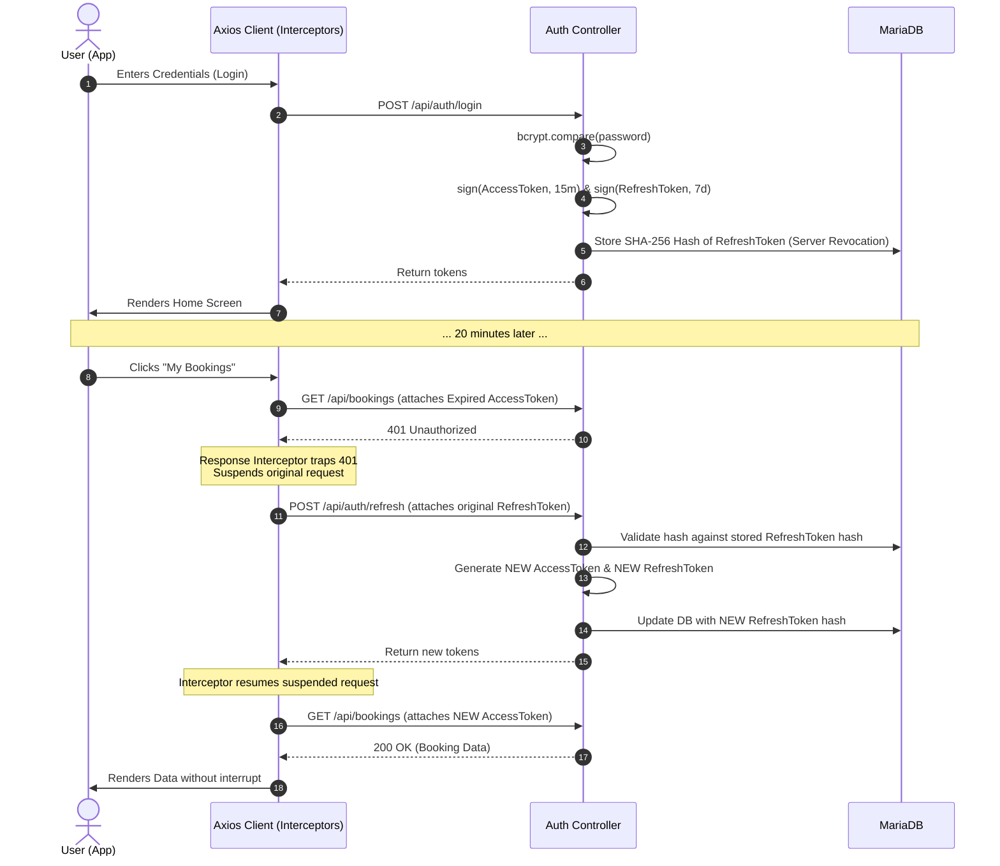
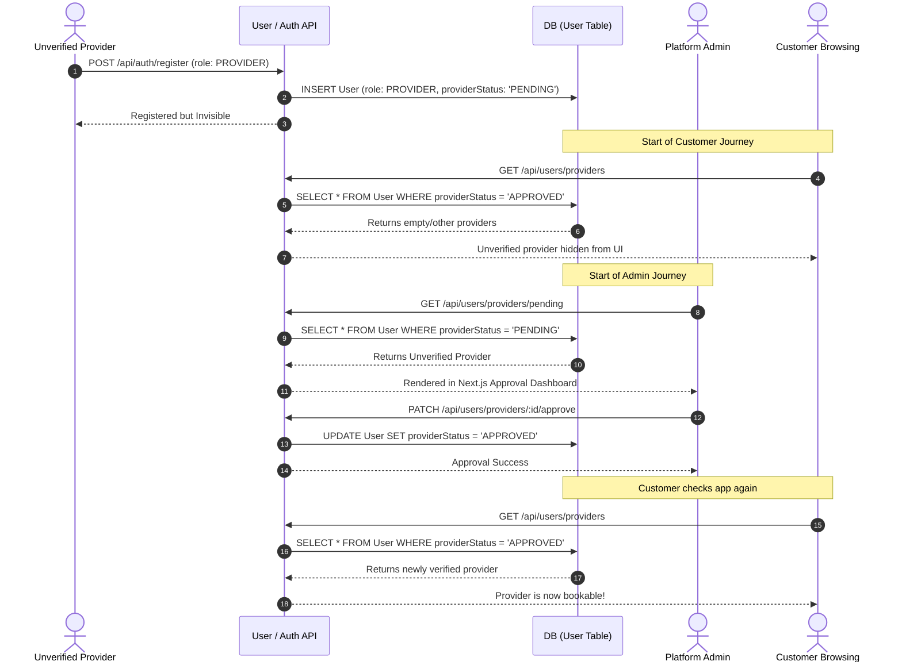
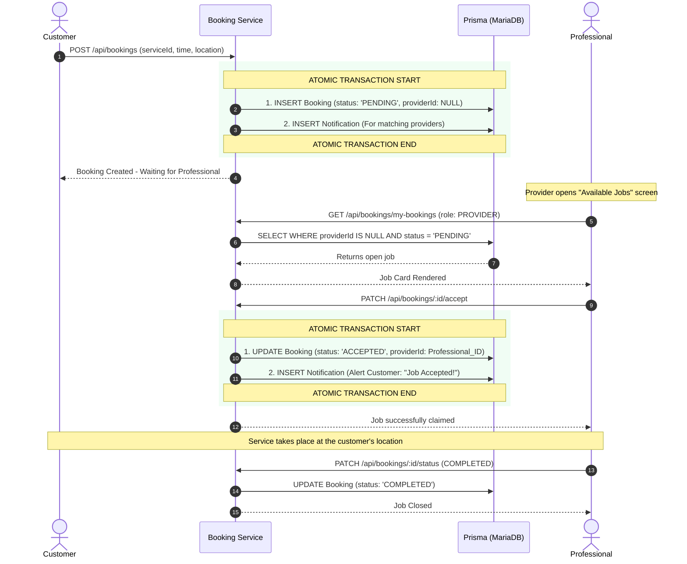
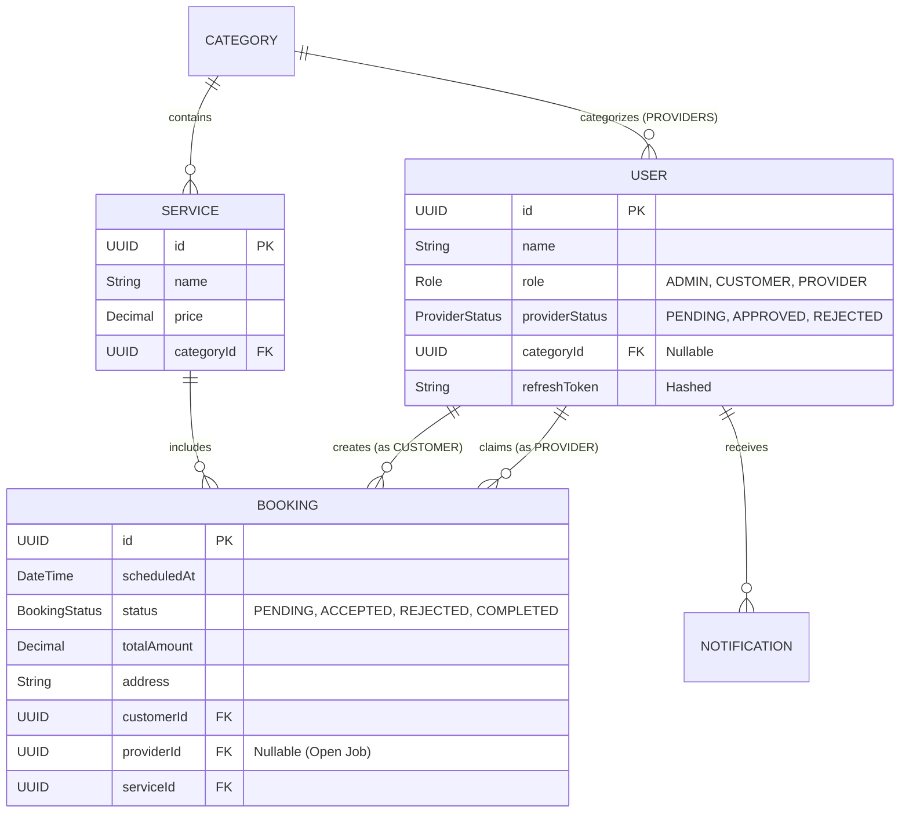

# On-Demand Service Application - System Diagrams

This document contains detailed architectural diagrams explaining the data flow and structure of the On-Demand Service platform. These diagrams are designed for technical interviews, system documentation, and architecture reviews.

## 1. High-Level System Architecture
This diagram illustrates the layered request lifecycle from the client applications through the API gateway down to the database. It highlights the strict Separation of Concerns (Controller -> Service -> DB).

---

## 2. Authentication & Secure Token Rotation Flow
This sequence details how the system handles secure logins and automatic (silent) token refreshes when the short-lived access token expires.

---

## 3. Provider Onboarding & Admin Approval Flow
Demonstrates the separation of provider creation and public visibility using administrative database flags.

---

## 4. Comprehensive Booking & Job Execution Flow
A visual walkthrough of the 'Open Marketplace' booking system. It tracks state mutations (`PENDING` -> `ACCEPTED` -> `COMPLETED`) and emphasizes Atomicity with Prisma Transactions.

---

## 5. ERD (Entity Relationship Diagram)
Visual representation of the relational data schema in MariaDB.

